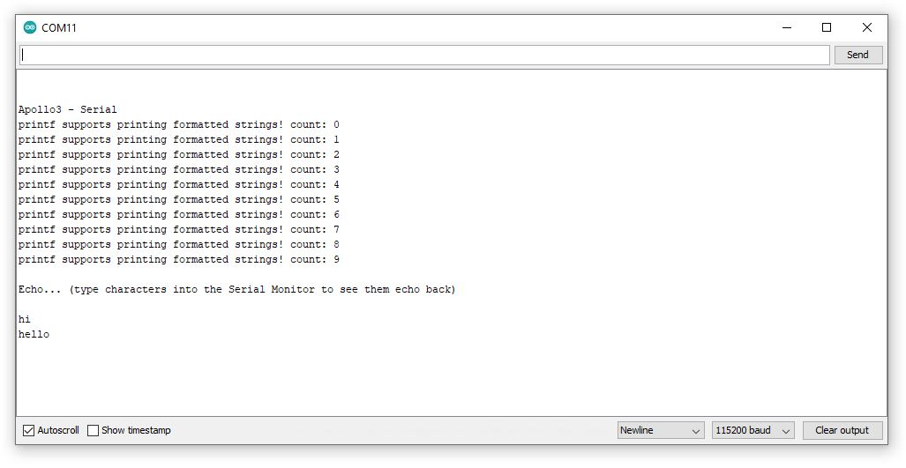
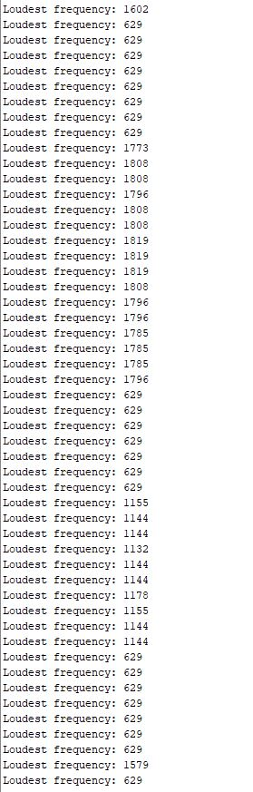

# Lab 1: Artemis
### Sean Han (ssh95)
### ECE 4960: Fast Robots

## Goal
The goal of this lab was to get familiar with the Artemis RedBoard Nano from Sparkfun. It was also to test whether the given board was functioning properly by testing its built-in LED and sensors. 

## Materials/Tools Used
* 1 Sparkfun Artemis RedBoard Nano
* 1 Computer
* 1 USB-A to USB-C Cable

## Procedure
1. The Arduino IDE was installed.  
2. The Apollo3 board package was installed to allow the Artemis RedBoard Nano to be compatible. Then, the physical Artemis RedBoard Nano was connected to the computer via the USB-A to USB-C Cable. 
3. The Blink example sketch was uploaded to the board to make the built-in LED turn on and off repeatedly.
4. The Serial example was uploaded to test the board's serial port's functionality. The figure below shows the working serial monitor.

5. The analogRead example was uploaded to test the board's temperature sensor. The board's temperature readings were observed while it was held in hands and then blown on.The figure below shows the working temperature sensor.

6. The MicrophoneOutput example was uploaded to test the board's frequency sensor. The frequency readings were observed while whistling and and singing near the board. The figure below shows the working frequency sensor.

Note: The code for the 4 example sketches came installed with the Arduino IDE and the Apollo3 board package. 
